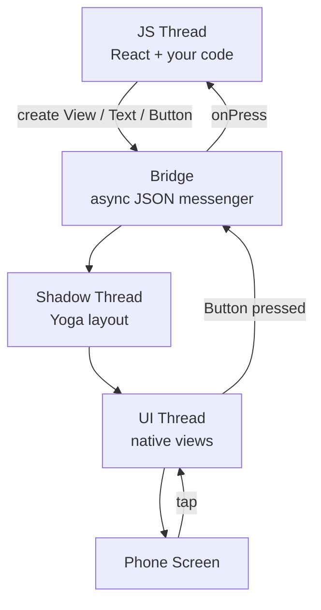
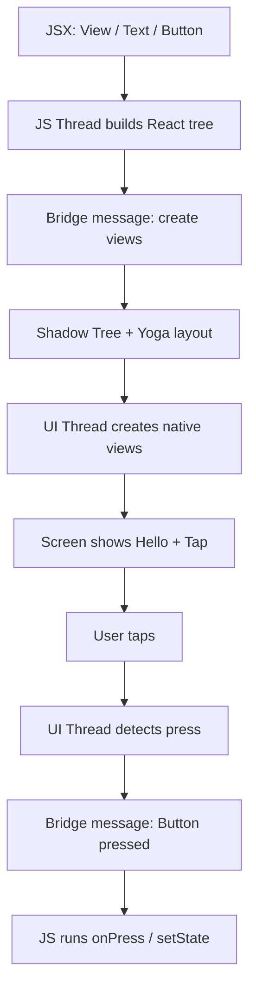
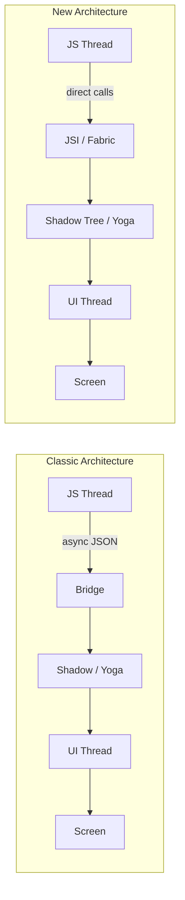
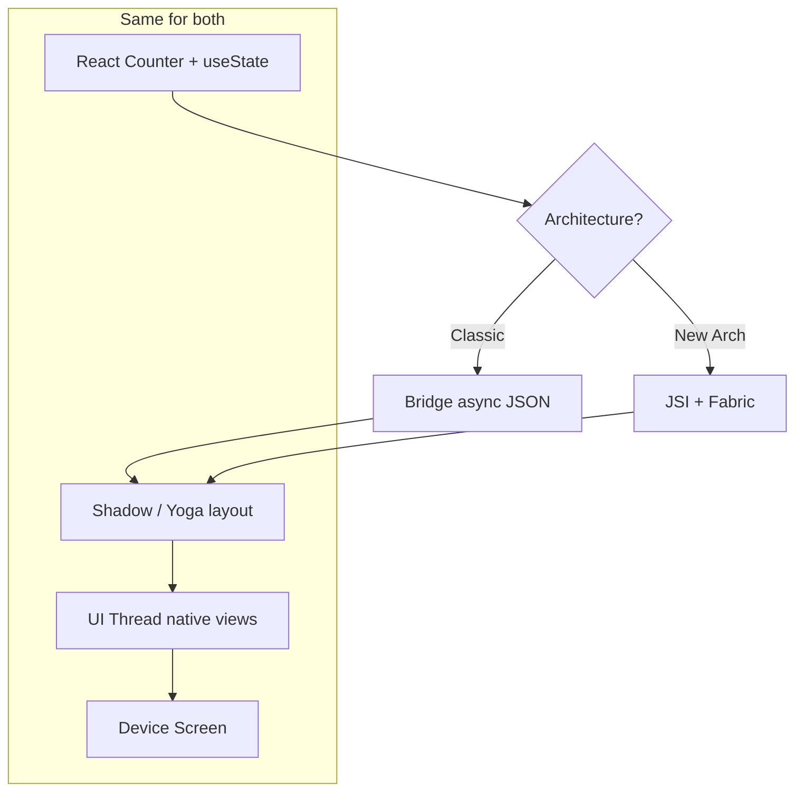

# how-react-native-work

# How React Native Works — From Bridge to New Architecture

> One visual guide in two parts: **Beginner** (Bridge in the center) → **Advanced** (Classic Bridge vs JSI / Fabric). Follow JSX to native UI, then compare both architectures with the same `Counter`.

**Topics:** React Native · Bridge · JSI · Fabric · TurboModules · Interview Prep

| Part | Style | Interactive demo |
|------|--------|------------------|
| **Part 1** | Beginner — one story, Bridge in the center | [`react-native-how-it-works-animation.html`](./react-native-how-it-works-animation.html) |
| **Part 2** | Advanced — Classic Bridge vs New Arch | [`react-native-behind-the-scenes-animation.html`](./react-native-behind-the-scenes-animation.html) |

---

## Table of contents

- [What you’ll learn](#what-youll-learn)
- [Part 1 — How React Native works (Bridge story)](#part-1--how-react-native-works-bridge-story)
  - [The four workers](#the-four-workers)
  - [Example code](#example-code-part-1)
  - [Runtime map](#runtime-map)
  - [Step-by-step walkthrough](#step-by-step-walkthrough)
  - [Complete flow](#complete-flow)
  - [Easy way to remember](#easy-way-to-remember)
- [Part 2 — Classic Bridge vs New Architecture](#part-2--classic-bridge-vs-new-architecture)
  - [The panels](#the-panels)
  - [Counter example](#counter-example)
  - [Two architectures at a glance](#two-architectures-at-a-glance)
  - [Classic Architecture walkthrough](#classic-architecture-walkthrough)
  - [New Architecture walkthrough](#new-architecture-walkthrough)
  - [Side-by-side comparison](#side-by-side-comparison)
- [Interview cheat sheet](#interview-cheat-sheet)
- [Quick challenges](#quick-challenges)
- [Conclusion](#conclusion)

---

Most people think React Native is “React in a WebView.”

It is not.

You write React/JSX. React Native turns that into **real native views** — `UIView` on iOS, `android.view` on Android.

> **Part 1 path:** JS Thread → Bridge → Shadow Thread (Yoga) → UI Thread → Screen  
> **Part 2 upgrade:** Bridge JSON → JSI / Fabric / TurboModules

---

## What you’ll learn

**Part 1 (Beginner)**

- Why React Native is not a WebView
- What the **JS Thread**, **Bridge**, **Shadow Thread**, and **UI Thread** each do
- How first render and a tap travel through the Bridge

**Part 2 (Advanced)**

- Why the Bridge can become a bottleneck
- What **JSI**, **Fabric**, and **TurboModules** each replace
- How the same `setState` round-trip looks in Classic vs New Arch

---

# Part 1 — How React Native works (Bridge story)

**Demo:** open [`react-native-how-it-works-animation.html`](./react-native-how-it-works-animation.html) and press Play.

---

## The four workers

| Panel | Role |
|-------|------|
| **Your RN Code** | JSX you wrote (`View`, `Text`, `Button`) |
| **JS Thread** | Runs React + your business logic (Hermes / JSC) |
| **Bridge** | Messenger — async JSON between JS and Native |
| **Shadow Thread** | Builds layout tree; **Yoga** computes x, y, width, height |
| **UI Thread** | Creates and paints real native views |
| **Phone Screen** | What the user actually sees |

### Color meaning

- 🔵 **JS Thread** → React + your code
- 🟡 **Bridge** → messenger (JSON)
- 🟢 **Shadow Thread** → layout (Yoga)
- 🔴 **UI Thread** → real native views

### Golden rule

```text
1) JS builds a React tree
2) Bridge carries a message to Native
3) Shadow/Yoga calculates layout
4) UI Thread paints native views
5) Events travel the other way through the Bridge
```

---

## Example code (Part 1)

```js
function App() {
  return (
    <View>
      <Text>Hello</Text>
      <Button title="Tap" onPress={onTap} />
    </View>
  );
}
```

Goal:

1. Turn this into a real native screen  
2. Handle a tap and run `onPress` back in JS  

---

## Runtime map



<details>
<summary>ASCII version</summary>

```text
                 React Native (Classic story)

   ┌──────────────┐         ┌──────────────┐
   │  JS Thread   │◄───────►│    Bridge    │
   │ React + logic│  JSON   │   messenger  │
   └──────────────┘         └──────┬───────┘
                                   │
                    ┌──────────────┼──────────────┐
                    ▼                             ▼
           ┌────────────────┐            ┌────────────────┐
           │ Shadow Thread  │            │   UI Thread    │
           │  Yoga layout   │───────────►│ native views   │
           └────────────────┘            └───────┬────────┘
                                                 ▼
                                          ┌────────────┐
                                          │   Screen   │
                                          └────────────┘
```

</details>

---

## Step-by-step walkthrough

Same steps as the beginner animation.

### Step 1 — Idea

> React Native = write React code, show real native UI (not HTML in a browser).

Three workers + one messenger: JS Thread, Shadow Thread, UI Thread, and the **Bridge** in the center.

### Step 2 — JS Thread

> JS Thread runs your React code. `App()` starts.

Hermes/JSC executes JavaScript. No native buttons exist yet.

**Active:** `Run App()`

### Step 3 — React tree

> React creates an element tree from JSX: `View`, `Text`, `Button`.

This tree is still **JavaScript objects** — not real iOS/Android views.

### Step 4 — Bridge

> JS cannot create native views by itself. It sends a message through the Bridge.

Classic RN: Bridge messages are **async JSON**.

**Message:** `create View, Text, Button`

### Step 5 — Shadow Thread

> Shadow Thread builds a Shadow Tree from that message.

Shadow Tree = layout structure (**still not pixels**).

### Step 6 — Yoga layout

> Yoga calculates layout: x, y, width, height for every node.

Flexbox styles from JS become real positions here.

### Step 7 — UI Thread

> UI / Main Thread creates real native views (`UIView` / `android.view`).

This is why RN apps feel native — they use platform UI components.

### Step 8 — Screen

> Native views are drawn. User finally sees “Hello” and the Tap button.

```text
JS → Bridge → Shadow/Yoga → UI → Screen
```

### Step 9 — User taps

> User taps the button. Touch is handled first on the UI Thread (native).

Native side felt the press. **JS does not know yet.**

### Step 10 — Back to JS

> Native sends “Button pressed” back through the Bridge to the JS Thread.

```text
Native → Bridge → JS
```

Then your `onPress` / `setState` can run.

### Part 1 done

> JS thinks, Bridge talks, Shadow lays out, UI paints.

New Architecture replaces Bridge JSON with **JSI / Fabric** — same idea, faster path. That’s Part 2.

---

## Complete flow



<details>
<summary>ASCII version</summary>

```text
JSX → JS Thread → Bridge → Shadow/Yoga → UI Thread → Screen
                                      ↑
User tap → UI Thread → Bridge → JS onPress ─┘
```

</details>

---

## Easy way to remember

Think of React Native as a restaurant with a runner:

- 👨‍🍳 **JS Thread** = Chef deciding the menu (React tree)
- 📨 **Bridge** = Runner carrying tickets (JSON messages)
- 📐 **Shadow / Yoga** = Floor plan — where every plate goes
- 🍽️ **UI Thread** = Servers placing real plates on the table
- 📱 **Screen** = What the guest sees

Tap: guest presses the bell (**UI**) → runner brings the ticket (**Bridge**) → chef reacts (**JS `onPress`**).

---

# Part 2 — Classic Bridge vs New Architecture

**Demo:** open [`react-native-behind-the-scenes-animation.html`](./react-native-behind-the-scenes-animation.html), switch Classic / New Architecture, then press Play.

The React mental model stays the same.  
What changes is **how JS talks to native**.

| Architecture | Communication layer |
|--------------|---------------------|
| **Classic** | Bridge — async JSON messages |
| **New Arch** | JSI + Fabric + TurboModules — more direct calls |

---

## The panels

| Panel | Meaning |
|-------|---------|
| **React Native Code** | Your JSX / hooks |
| **JS Thread** | Hermes + React + business logic |
| **Bridge** *or* **JSI / Fabric** | How JS ↔ Native communicate |
| **Shadow Tree / Yoga** | Layout calculation |
| **UI / Main Thread** | Real native views + touch |
| **Device Screen** | What the user sees |

### Golden rules

**Classic**

```text
JS → Bridge (JSON) → Shadow/Yoga → UI Thread → Screen
(and back through Bridge for events)
```

**New Architecture**

```text
JS → JSI / Fabric → Shadow Tree → UI Thread → Screen
(TurboModules for native APIs)
```

---

## Counter example

```js
function Counter() {
  const [n, setN] = useState(0);
  return (
    <View>
      <Text>{n}</Text>
      <Button title="+" onPress={() => setN(n + 1)} />
    </View>
  );
}
```

We follow twice (Classic, then New Arch):

1. Boot + first render (`n = 0`)
2. User taps `+`
3. `setN(n + 1)` + re-render
4. Native Text updates to `1`

---

## Two architectures at a glance



<details>
<summary>ASCII version</summary>

```text
Classic:  JS → Bridge (JSON) → Shadow/Yoga → UI → Screen
New Arch: JS → JSI / Fabric → Shadow Tree → UI → Screen
```

</details>

---

## Classic Architecture walkthrough

### Step 1 — Boot

Hermes loads the JS bundle. RN runtime is ready on the JS Thread. Native UI is still empty.

### Step 2 — JS Thread

`Counter()` + `useState(0)` + JSX element tree. Still only JavaScript — no real `UIView` yet.

### Step 3 — Bridge

Async JSON over the Bridge:

```text
serialize → queue → deserialize
```

**Message:** `JSON: create View / Text / Button`

### Step 4 — Shadow / Yoga

Shadow Tree + Yoga layout (`x`, `y`, `width`, `height`). Not pixels yet.

### Step 5 — UI Thread

Real native views mounted. Screen shows `0` and `+`.

### Step 6 — User tap

Touch handled by native Button on the UI Thread first.

### Step 7 — Bridge event

```text
Native → Bridge → JS Thread
```

### Step 8 — JS update

`setN(n + 1)` · React re-renders · reconcile `Text: 0 → 1`.

### Step 9 — Bridge update

Another JSON message: update Text props. Serialize cost again.

### Step 10 — Layout + UI

Shadow Tree updates → UI Thread paints `1`.

**Classic complete:**

```text
JS → Bridge → Shadow/Yoga → UI Thread → Screen
```

**Takeaway:** Bridge is powerful, but async + JSON can become a bottleneck.

---

## New Architecture walkthrough

Same React code. Different communication layer.

### Step 1 — Boot

Hermes + New Architecture. **JSI** available. **TurboModules** can load lazily.

### Step 2 — JS Thread

Same `Counter()` / `useState` / JSX. Same React mental model — different native path.

### Step 3 — JSI / Fabric

No JSON Bridge bottleneck. JSI lets JS call C++/native directly. Fabric receives UI commands.

### Step 4 — Fabric Shadow Tree

Immutable Shadow Tree + Yoga, with better concurrent rendering support.

### Step 5 — UI Thread

Native views from Fabric’s shadow tree. Screen shows `0` and `+`.

### Step 6 — User tap

Touch still starts on the native UI Thread.

### Step 7 — JSI event

Event reaches JS through JSI — more direct than Bridge JSON.

### Step 8 — JS update

`setN(n + 1)` · re-render · reconcile `Text 0 → 1`. Your React code is unchanged.

### Step 9 — Fabric update

Fabric updates the Text Shadow Tree node via JSI-backed pipeline.

**Trio:** JSI + Fabric + TurboModules

### Step 10 — Layout + UI

Yoga commit + UI Thread paints `1`.

**New Arch complete:**

```text
JS → JSI / Fabric → Shadow Tree → UI Thread → Screen
```

**Interview line:** Bridge = async JSON. JSI = direct host object calls.

---

## Side-by-side comparison

| Step | Classic (Bridge) | New Architecture |
|------|------------------|------------------|
| Boot | Hermes + Bridge runtime | Hermes + JSI / Fabric / TurboModules |
| First UI command | Async JSON over Bridge | JSI / Fabric UI commands |
| Layout | Shadow Thread + Yoga | Fabric Shadow Tree + Yoga |
| Native mount | UI Thread | UI Thread (same idea) |
| Tap → JS | Bridge JSON event | JSI direct event |
| `setState` update | Another Bridge JSON message | Fabric Shadow Tree update via JSI |
| Native APIs | Legacy Native Modules | TurboModules (lazy, typed) |



---

## Interview cheat sheet

### Is React Native a WebView?

No. It renders **real native views**.

### Who does what?

| Piece | Role |
|-------|------|
| **JS Thread** | React + logic |
| **Bridge** | Classic messenger — async JSON |
| **JSI** | Direct JS ↔ native host object access |
| **Fabric** | New rendering system / Shadow Tree |
| **TurboModules** | Lazy, typed native modules |
| **Shadow Thread + Yoga** | Layout calculation |
| **UI Thread** | Native views + drawing + touch |

### Classic vs New — one sentence each

**Classic:** JS and Native talk through an async JSON Bridge; Yoga lays out; UI Thread mounts real views.

**New Arch:** JSI allows direct calls; Fabric is the new renderer; TurboModules are lazy native modules — less JSON serialization.

### One-line interview answer

> React Native runs React on the JS Thread and paints real native views on the UI Thread. Classic RN connects them with an async JSON Bridge; the New Architecture replaces that path with JSI, Fabric, and TurboModules — while your component code stays the same.

---

## Quick challenges

### Challenge 1 — First paint + tap (Part 1)

```js
function App() {
  return (
    <View>
      <Text>Hello</Text>
      <Button title="Tap" onPress={onTap} />
    </View>
  );
}
```

<details>
<summary>Reveal answer</summary>

**First paint**

```text
JS Thread → Bridge → Shadow/Yoga → UI Thread → Screen
```

**Button press**

```text
UI Thread (native tap) → Bridge → JS Thread (onPress)
```

</details>

### Challenge 2 — Classic vs New (Part 2)

```text
A) JS → Bridge (JSON) → Shadow/Yoga → UI → Screen
B) JS → JSI/Fabric → Shadow Tree → UI → Screen
```

1. Which is Classic / New?  
2. Where is the touch detected first?  
3. How does the Text update reach native in each?

<details>
<summary>Reveal answer</summary>

- **A = Classic**, **B = New Architecture**
- Touch is detected first on the **UI Thread** in both
- Classic: event + update via **Bridge JSON**  
  New Arch: event via **JSI**, update via **Fabric** Shadow Tree, then UI paints `1`

</details>

---

## Conclusion

**Part 1:** Once you watch one screen travel through the Bridge, RN stops feeling magical.

```text
JS thinks → Bridge talks → Shadow lays out → UI paints
```

**Part 2:** Same React. Two native highways.

1. **Classic** = Bridge + async JSON  
2. **New Arch** = JSI + Fabric + TurboModules  
3. **Yoga + UI Thread** still produce real native UI  

**Try the animations:**

- Beginner: [`react-native-how-it-works-animation.html`](./react-native-how-it-works-animation.html)
- Advanced: [`react-native-behind-the-scenes-animation.html`](./react-native-behind-the-scenes-animation.html)
